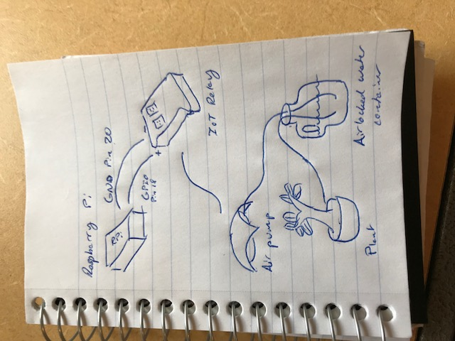

# rpi-watering
Automated plant watering system built using Raspberry Pi.

The materials I used for this project are listed below. They are based on the materials used by [pleasetakecareofmyplant](https://github.com/t-jayw/pleasetakecareofmyplant), although the code and mechanism for watering differ significantly.
- [Raspberry Pi](https://www.amazon.com/gp/product/B01CD5VC92/ref=oh_aui_detailpage_o01_s00?ie=UTF8&psc=1): obviously needed to run the code. It connects to the IoT relay using the GPIO pins on the board and two female-to-female jumper wires.
- [IoT relay](https://www.amazon.com/gp/product/B00WV7GMA2/ref=oh_aui_detailpage_o09_s00?ie=UTF8&psc=1): this relay has three power outputs: one that is always on, two that are off by default, and one that is on by default. When the Raspberry Pi outputs `GPIO.HIGH` to the relay, the latter three outputs will reverse states (the first will stay powered on). When `GPIO.LOW` is sent to the relay, the power sockets will revert to their defaults.
- [Air pump](https://www.amazon.com/gp/product/B0009YJ4N6/ref=oh_aui_detailpage_o09_s00?ie=UTF8&psc=1): this is plugged into one of the power sockets on the IoT relay that is off by default. When turned on, it'll pump air into the water container, which in turn will force water out of the container and onto the plant.
- [Tubing](https://www.amazon.com/gp/product/B0002563MW/ref=oh_aui_detailpage_o09_s00?ie=UTF8&psc=1): this is just used to pump air into, and water out of, the container. It is important that the tubing on the inside of the container is submerged in water.
- Water container: for this, I just used an old one-gallon water bottle that you can buy at a grocery store for ~$1. Whatever you choose here, **it is crucial that no air or water is allowed to escape the container except through the tubing**! The watering system works by adding air pressure to the container, and when enough pressure has built up, water will be forced out of the container, going up through the part of the tubing that isn't connected to the air pump and onto the plant. If air is allowed to escape the container, there won't be enough pressure to expel water.
	To seal the bottle, I closed the container tightly, and applied a lot of glue to where the tubing enters and exits the container. Glue may wear out over time, so it's important to check occasionally that water is actually exiting the container when the air pump is switched on. If it doesn't, 99% of the time that indicates a problem with some part of the system not being sufficiently airlocked.

Here's a brief sketch of the system in its entirety:

